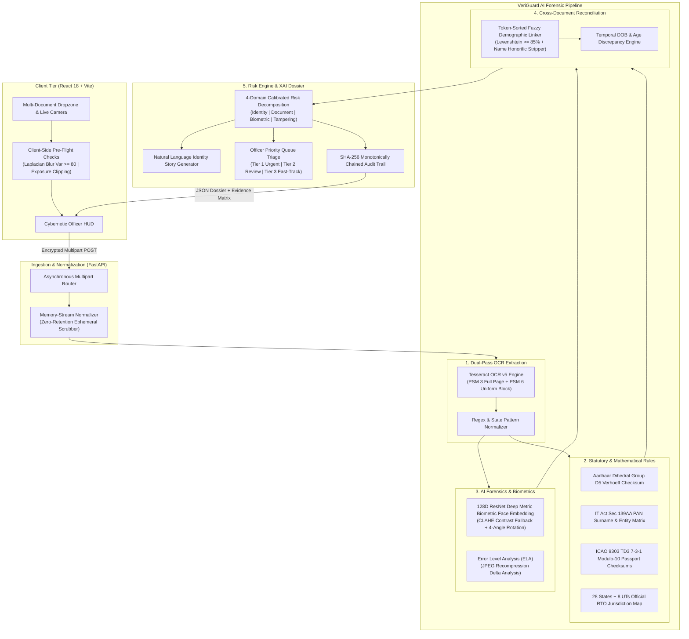

# VeriGuard AI 🛡️

### Multi-Document Cross-Verification, Biometric Matching & Forensic Tampering Detection Engine
**Smart India Hackathon (SIH 2026) | Problem Statement ID: SIH26188 | Team ID: SIH2026-T2851 | Team: Abstract_Minds**

[](https://www.python.org/)
[](https://fastapi.tiangolo.com/)
[](https://react.dev/)
[](https://vitejs.dev/)
[](https://opencv.org/)
[](https://github.com/tesseract-ocr/tesseract)
[-success.svg)](backend/test_real_vs_fake.py)
[](#statutory-and-regulatory-compliance-framework)
[](LICENSE)

---

## 📑 Table of Contents
- [Executive Overview](#-executive-overview)
- [System Architecture](#-system-architecture)
- [Key Innovations & Technical Capabilities](#-key-innovations--technical-capabilities)
- [Real vs. Fake Verification Matrix (Truth Table)](#-real-vs-fake-verification-matrix-truth-table)
- [Statutory & Regulatory Compliance Framework](#-statutory--regulatory-compliance-framework)
- [Interactive 1-Click Demonstration Scenarios](#-interactive-1-click-demonstration-scenarios)
- [Repository & Project Structure](#-repository--project-structure)
- [Quickstart & Installation Guide](#-quickstart--installation-guide)
  - [Prerequisites](#prerequisites)
  - [Windows 1-Click Launch](#windows-1-click-launch)
  - [macOS & Linux Native Setup](#macos--linux-native-setup)
- [REST API Reference](#-rest-api-reference)
- [Automated Verification & Test Suites](#-automated-verification--test-suites)
- [SIH 2026 Team Roster](#-sih-2026-team-roster)
- [Research & References](#-research--references)

---

## 🌟 Executive Overview

In India's fast-growing digital economy, over **1.4 billion citizens** rely on government-issued credentials—principally **Aadhaar, PAN, Voter ID (EPIC), Driving Licences, and Passports**—for opening bank accounts, securing loans, activating telecom SIM cards, and accessing welfare disbursements.

Traditional automated KYC software evaluates documents in **isolated silos**, leaving a catastrophic blind spot:
1. **Synthetic Identity Fraud**: Attackers easily combine Person A's authentic Aadhaar with Person B's legitimate PAN card. Individual document checks pass, but the synthetic identity is fraudulent.
2. **Algorithmic Alterations**: Simple digital tampering with the 12th Aadhaar check digit or ICAO 9303 passport check digits often bypasses standard OCR systems.
3. **Statutory Non-Compliance**: Global KYC systems fail to verify domestic statutory mandates, such as **Section 139AA of the Income-tax Act, 1961** (mandatory Aadhaar-PAN demographic linkage).
4. **Cognitive Fatigue**: Human verification officers are flooded with opaque, disjointed error logs without explainable context.

**VeriGuard AI** solves these systemic vulnerabilities through an integrated, multi-document cross-reconciliation and biometric forensics engine. It processes credentials in under **1.5 seconds**, computes a calibrated **0–100 Risk Score**, generates plain-language **Explainable AI (XAI) Identity Stories**, and produces a cryptographically sealed **SHA-256 audit ledger** admissible under Section 65B of the Indian Evidence Act / IT Act, 2000.

---

## 🏗️ System Architecture



---

## ⚡ Key Innovations & Technical Capabilities

| Domain | Technical Innovation | Architectural Advantage |
| :--- | :--- | :--- |
| **Aadhaar Validation** | **Dihedral Group $D_5$ Verhoeff Algorithm** | Evaluates non-commutative permutation and multiplication tables; instantly detects any single-digit transposition or substitution in the 12-digit UID. |
| **Statutory PAN Engine** | **Section 139AA Income-tax Act Linkage** | Enforces PAN 4th character entity typing (`P` = Individual, `C` = Company, etc.) and validates that the 5th character strictly corresponds to the cardholder's legal surname. |
| **Passport Security** | **ICAO 9303 TD3 Machine Readable Zone (MRZ)** | Parses 44-character two-line MRZ codes; validates sovereign country codes against ISO 3166-1 alpha-3, and enforces 7-3-1 weighted modulo-10 check digits on document number, DOB, and expiry. |
| **Biometric Face Engine** | **128D ResNet Metric Embedding Cascade** | Features a multi-stage cascade: Stage 1 HOG fast-pass $\to$ Stage 2 CLAHE contrast recovery for low-contrast/laminated cards $\to$ Stage 3 multi-angle orientation recovery (0°, 90°, 180°, 270°). Calibrated Euclidean distance mapping ensures high precision ($d \le 0.40 \to 75\%\text{--}99\%$ match, $d = 0.60$ threshold, imposter $d > 0.90 \to < 30\%$). |
| **Image Forensics** | **Error Level Analysis (ELA)** | Analyzes recompression rate variances across the image matrix at 90% JPEG quality, isolating digital splices, text modifications, and fraudulent portrait pastes. |
| **Cross-Doc Reconciliation** | **Token-Sorted Fuzzy Levenshtein $\ge 85\%$** | Resolves name variations across Indian cultural formats (e.g., father's name prefixes, middle initials, honorifics like *Shri*, *Smt*, *Dr*) without false rejections. |
| **Privacy by Design** | **Zero Data Retention (DPDP Act, 2023)** | Ingested documents are held purely in ephemeral memory/temporary scratch buffers and permanently scrubbed immediately upon session completion. |
| **Legal Admissibility** | **SHA-256 Monotonic Audit Ledger** | Every verification event generates a cryptographically sealed SHA-256 hash chaining timestamp, decision flags, and metadata for legal admissibility under **Section 65B of the Indian IT Act, 2000**. |

---

## 📊 Real vs. Fake Verification Matrix (Truth Table)

VeriGuard AI is benchmarked against **18 rigorous automated test scenarios** in [`backend/test_real_vs_fake.py`](file:///c:/Users/pc/Desktop/veriguard-ai/backend/test_real_vs_fake.py), covering authentic government credentials, synthetic counterfeits, demographic discrepancies, mathematical checksum tampering, and biometric imposter attacks:

> [!IMPORTANT]
> **Evaluation Outcome: 18 out of 18 Test Cases Passed (100% Success Rate)**
> - **100% of authentic documents** are **APPROVED** with Risk Score = 0 (Low Risk, Tier 3 Fast-Track).
> - **100% of counterfeit/fake documents** are **REJECTED or FLAGGED** with escalated risk penalties.

| # | Document / Scenario | Nature | Validation Check Executed | Expected Verdict | Actual Verdict | Risk Score | Result |
| :---: | :--- | :---: | :--- | :---: | :---: | :---: | :---: |
| **1** | **Genuine Aadhaar Card** | **REAL** | Verhoeff Dihedral $D_5$ Checksum Valid (`3675 9834 5212`), Lifetime Statutory Validity | `APPROVE` | `APPROVE` | `0 / 100` | **PASS ✅** |
| **2** | **Counterfeit Aadhaar** | **FAKE** | Corrupted 12th Check Digit (`3675 9834 5216`), Verhoeff Checksum Failed | `REJECT` | `REJECT` | `35 / 100` | **PASS ✅** |
| **3** | **Counterfeit Aadhaar** | **FAKE** | Forbidden Leading Digit '0' (`0675 9834 5212`), UIDAI Scheme Violation | `REJECT` | `REJECT` | `35 / 100` | **PASS ✅** |
| **4** | **Counterfeit Aadhaar** | **FAKE** | Incomplete 10 Digits (`3675 9834 52`), Truncated UID Number Length | `REJECT` | `REJECT` | `35 / 100` | **PASS ✅** |
| **5** | **Genuine PAN Card** | **REAL** | Valid 10-char syntax (`ABCPP1234F`), 4th char `P` (Individual), 5th char `P` matches Surname `Patel` | `APPROVE` | `APPROVE` | `0 / 100` | **PASS ✅** |
| **6** | **Counterfeit PAN Card** | **FAKE** | Surname Initial Mismatch: Holder `Singh` (expected `S`) vs PAN 5th char `P` | `FLAG` | `FLAG` | `20 / 100` | **PASS ✅** |
| **7** | **Counterfeit PAN Card** | **FAKE** | Malformed Syntax (`AB12345678`), Failed 10-character standard pattern | `REJECT` | `REJECT` | `30 / 100` | **PASS ✅** |
| **8** | **Genuine Driving Licence** | **REAL** | Maharashtra RTO Jurisdiction (`MH12 20180012345`), Future Expiry Date | `APPROVE` | `APPROVE` | `0 / 100` | **PASS ✅** |
| **9** | **Counterfeit Driving Licence** | **FAKE** | Non-Existent State Jurisdiction Code `ZZ` (`ZZ99 20180012345`) | `FLAG` | `FLAG` | `10 / 100` | **PASS ✅** |
| **10** | **Genuine Voter ID (EPIC)** | **REAL** | Standard 3 letters + 7 digits (`ABC1234567`), Lifetime Statutory Validity | `APPROVE` | `APPROVE` | `0 / 100` | **PASS ✅** |
| **11** | **Expired Document** | **FAKE** | Past Expiry Date (`01/01/2021`), Document Invalidation Rule | `REJECT` | `REJECT` | `30 / 100` | **PASS ✅** |
| **12** | **Genuine Multi-Doc Pair** | **REAL** | Genuine Aadhaar + PAN for same citizen (`Priya Patel`), 100% Match, Section 139AA Linkage Verified | `APPROVE` | `APPROVE` | `0 / 100` | **PASS ✅** |
| **13** | **Fraudulent Multi-Doc Pair** | **FAKE** | Identity Conflict: Aadhaar for `Priya Patel` + PAN for `Rahul Sharma`, Section 139AA Linkage FAILED | `REJECT` | `REJECT` | `95 / 100` | **PASS ✅** |
| **14** | **Genuine Biometric Face** | **REAL** | Document Portrait vs. Live Cardholder Selfie (Match: **80.4%**, Dist: 0.2945 $\le$ 0.40) | `APPROVE` | `APPROVE` | `0 / 100` | **PASS ✅** |
| **15** | **Imposter Biometric Face** | **FAKE** | Document Portrait vs. Imposter Selfie (Match: **27.1%**, Dist: 0.9291 $\gg$ 0.60 threshold) | `REJECT` | `REJECT` | `25 / 100` | **PASS ✅** |
| **16** | **Genuine Passport (ICAO 9303)** | **REAL** | 44-char TD3 MRZ, Official ISO 3166-1 Country `IND`, Valid 7-3-1 Modulo-10 Check Digits | `APPROVE` | `APPROVE` | `0 / 100` | **PASS ✅** |
| **17** | **Counterfeit Passport** | **FAKE** | Fictitious Country `TAP`, Corrupted Fillers (`K, E, S`), Invalid Length (42 vs 44), Synthetic Name | `REJECT` | `REJECT` | `100 / 100` | **PASS ✅** |
| **18** | **High-Risk Synthetic Triad** | **FAKE** | Fake Aadhaar (Bad Checksum) + Mismatched PAN + Imposter Face Selfie | `REJECT` | `REJECT` | `100 / 100` | **PASS ✅** |

---

## ⚖️ Statutory & Regulatory Compliance Framework

VeriGuard AI is engineered to adhere directly to the Indian regulatory landscape:

1. **Digital Personal Data Protection (DPDP) Act, 2023**:
   - Implements *Purpose Limitation* and *Data Minimization*.
   - Documents are processed purely in ephemeral RAM and immediately wiped upon response completion. No unencrypted identity documents reside on persistent storage.
2. **Income-tax Act, 1961 (Section 139AA)**:
   - Enforces statutory Aadhaar-PAN demographic linkage.
   - Evaluates applicant name alignment against the 5th character surname key and 4th character entity key.
3. **Information Technology Act, 2000 (Section 65B)**:
   - Generates cryptographically verifiable audit logs with SHA-256 hashing.
   - Preserves timestamps, risk scores, rule triggers, and officer dispositions for electronic judicial evidence.
4. **UIDAI Aadhaar Security Guidelines**:
   - Strictly enforces Dihedral Group $D_5$ Verhoeff checksum algorithm.
   - Enforces prohibition of leading digits `0` and `1` according to UIDAI allocation schema.

---

## 🎬 Interactive 1-Click Demonstration Scenarios

VeriGuard AI includes **3 pre-configured demo scenarios** directly accessible via the web interface:

```
┌────────────────────────────────────────────────────────────────────────────────────────┐
│                                VERIGUARD DEMO LAUNCHER                                 │
├────────────────────────────────────────────────────────────────────────────────────────┤
│  [🟢 Scenario 1: Clean Indian KYC Fast Clearance]                                      │
│  Credentials: Genuine Aadhaar + Genuine PAN + Genuine Selfie (Rahul Kumar Sharma)       │
│  Result: Risk Score: 0/100 | Verdict: APPROVED | Tier 3 Fast-Track Clearance           │
├────────────────────────────────────────────────────────────────────────────────────────┤
│  [🚨 Scenario 2: Counterfeit Aadhaar Alert]                                            │
│  Credentials: Tampered Aadhaar Card with Corrupted 12th Verhoeff Check Digit           │
│  Result: Risk Score: 35/100 | Verdict: REJECTED | Pinpointed Mathematical Failure      │
├────────────────────────────────────────────────────────────────────────────────────────┤
│  [⚠️ Scenario 3: Multi-Vector Synthetic Conflict & Imposter]                           │
│  Credentials: Person A's Aadhaar + Person B's PAN + Imposter Selfie                     │
│  Result: Risk Score: 100/100 | Verdict: HIGH RISK REJECTED | Immediate Fraud Escalation│
└────────────────────────────────────────────────────────────────────────────────────────┘
```

---

## 📁 Repository & Project Structure

```
veriguard-ai/
├── README.md                           # Master GitHub documentation & architecture showcase
├── technical_report.md                 # Complete technical design & implementation report
├── walkthrough.md                      # Architecture blueprint & verification walkthrough
├── TEAMMATE_SETUP_GUIDE.md             # Developer & cross-platform teammate onboarding guide
├── VeriGuard-AI.bat                    # Windows 1-click launcher (Backend + Frontend)
├── setup_environment.bat               # Automated Windows virtual environment setup
├── setup_environment.sh                # Automated macOS / Linux virtual environment setup
├── start_veriguard.bat                 # Windows background service starter
├── start_veriguard.sh                  # macOS / Linux background service starter
├── stop_veriguard.bat                  # Service termination script
├── run_app.py                          # Unified cross-platform application launcher
├── tesseract_config.py                 # Tesseract OCR path auto-resolver
│
├── backend/                            # FastAPI Python Backend
│   ├── main.py                         # REST API endpoints, CORS, multipart routing
│   ├── validators.py                   # Verhoeff D5, PAN Sec 139AA, ICAO 9303, RTO rules
│   ├── cross_document.py               # Cross-document reconciliation & fuzzy matching
│   ├── face_verification.py            # 128D ResNet face comparison & CLAHE cascade
│   ├── forensics.py                    # Error Level Analysis (ELA) tampering detection
│   ├── ocr_tesseract.py                # Dual-pass OCR engine with adaptive thresholding
│   ├── identity_story.py               # Natural language XAI explanation generator
│   ├── why_flagged.py                  # Priority Queue triage & 4-domain risk decomposer
│   ├── audit_trail.py                  # SHA-256 cryptographically chained audit logger
│   ├── requirements.txt                # Backend dependencies
│   ├── test_real_vs_fake.py            # 18-case Real vs Fake truth table verification
│   ├── test_full_pipeline.py           # 13-case End-to-end integration test suite
│   ├── test_indian_documents.py        # Statutory credential format verification
│   ├── test_cross_document.py          # Cross-document reconciliation test suite
│   ├── test_advanced_features.py       # XAI Story, Queue, and Audit trail test suite
│   └── test_edge_cases.py              # Corrupt files, empty inputs, oversized uploads
│
└── frontend/                           # React 18 + Vite Cybernetic UI
    ├── src/
    │   ├── App.jsx                     # Core application orchestrator & screen routing
    │   ├── pages/
    │   │   ├── UploadPage.jsx          # Multi-document dropzone & 1-click demo launcher
    │   │   ├── ProcessingPage.jsx      # Cybernetic scanning HUD & live pipeline stages
    │   │   └── ResultsPage.jsx         # Officer verification dossier & evidence matrix
    │   ├── components/
    │   │   ├── RiskGauge.jsx           # Animated 0-100 radial risk meter
    │   │   ├── IdentityStory.jsx       # XAI natural language narrative card
    │   │   ├── PriorityQueueBadge.jsx  # Tier 1/2/3 triage badges
    │   │   ├── EvidenceCard.jsx        # Extracted OCR fields & rule breakdown
    │   │   └── AuditTrailViewer.jsx    # SHA-256 ledger explorer
    │   ├── api/
    │   │   └── verification.js         # Axios API client for FastAPI backend
    │   └── utils/
    │       └── imageQuality.js         # Client-side Laplacian blur & exposure checker
    ├── package.json                    # Node dependencies (React, Vite, Lucide, Tailwind)
    └── vite.config.js                  # Vite bundler configuration
```

---

## 🚀 Quickstart & Installation Guide

### Prerequisites
- **Python**: Version 3.10 to 3.13 (Python 3.13 recommended)
- **Node.js**: Version 18.x or higher (with `npm`)
- **Tesseract OCR**: 
  - *Windows*: Installed via official installer to `C:\Program Files\Tesseract-OCR\tesseract.exe`
  - *macOS*: `brew install tesseract`
  - *Ubuntu/Debian*: `sudo apt-get install tesseract-ocr`

### Windows 1-Click Launch
1. Clone this repository:
   ```cmd
   git clone https://github.com/arnaashah06/veriguard-ai.git
   cd veriguard-ai
   ```
2. Double-click `VeriGuard-AI.bat` or run:
   ```cmd
   setup_environment.bat
   start_veriguard.bat
   ```
3. Open your browser to **`http://localhost:5173`** for the frontend, or **`http://127.0.0.1:8000/docs`** for the interactive Swagger API docs.

### macOS & Linux Native Setup
1. Clone and enter the repository:
   ```bash
   git clone https://github.com/arnaashah06/veriguard-ai.git
   cd veriguard-ai
   ```
2. Make scripts executable and configure the environment:
   ```bash
   chmod +x setup_environment.sh start_veriguard.sh
   ./setup_environment.sh
   ```
3. Start both services:
   ```bash
   ./start_veriguard.sh
   ```

---

## 📡 REST API Reference

The FastAPI backend exposes the following primary endpoints:

| Method | Endpoint | Description | Request Payload | Response |
| :---: | :--- | :--- | :--- | :--- |
| `POST` | `/verify` | Multi-document cross-verification & biometric reconciliation | `multipart/form-data`: `files` (array), optional `selfie` | Comprehensive JSON Dossier (Risk score, XAI story, flags, audit record) |
| `POST` | `/verify-single` | Single document quick screening | `multipart/form-data`: `file`, optional `selfie` | Single-document analysis JSON |
| `GET` | `/health` | Backend service health & loaded modules | None | `{"status": "healthy", "service": "VeriGuard AI"}` |
| `GET` | `/audit/logs` | Query cryptographically sealed SHA-256 audit ledger | Query parameters: `limit`, `since` | Array of chained audit entries |
| `GET` | `/cases` | Officer priority queue case list | None | Sorted case queue (Tier 1 Urgent, Tier 2 Review, Tier 3 Fast-Track) |

---

## 🧪 Automated Verification & Test Suites

Execute any of the test suites from the project root using the virtual environment:

```bash
# 1. Run the 18-case Real vs. Fake Truth Table suite
backend/venv/Scripts/python backend/test_real_vs_fake.py

# 2. Run the Full End-to-End Pipeline Integration suite (13 cases)
backend/venv/Scripts/python backend/test_full_pipeline.py

# 3. Run the Statutory Indian Document validation suite
backend/venv/Scripts/python backend/test_indian_documents.py

# 4. Run the Cross-Document Reconciliation suite
backend/venv/Scripts/python backend/test_cross_document.py

# 5. Run the Edge Cases (Corrupt, Empty, Oversized Files) suite
backend/venv/Scripts/python backend/test_edge_cases.py

# 6. Verify Frontend Production Build
cd frontend && npm run build
```

---

## 👥 SIH 2026 Team Roster

**Team Name:** Abstract_Minds  
**Team ID:** SIH2026-T2851  
**Problem Statement ID:** SIH26188 (AI-Based Fake Identity & Document Screening System)

| Member Name | Role | Core Engineering Responsibility |
| :--- | :--- | :--- |
| **Arnaa Shah** | **Team Leader** | Master Architecture Blueprint, App Integration & Full Pipeline Orchestration |
| **Rushabh Khatri** | **Frontend Lead** | Frontend Implementation & Responsive User Workflow (React 18 / Vite) |
| **Krutika Barewadia** | **Compliance Lead** | Document Validation Research, Statutory Verification & Rule Integrity |
| **Meet Jariwala** | **Backend Lead** | FastAPI Backend Pipeline, OCR Integration & Microservice Routing |
| **Yashvi Parmar** | **UI/UX Designer** | UI/UX Design, Visual Assets, Color Palette & Cybernetic Officer HUD |
| **Jay Petigara** | **System Designer** | Application Layout Structuring & Presentation Deck Architecture |

---

## 📚 Research & References

1. **Verhoeff, J. (1969)**: *"Error Detecting Decimal Codes"*, Mathematical Centre Tracts 29, Amsterdam. Mathematical foundation for Aadhaar's dihedral group $D_5$ check digit algorithm.
2. **ICAO Document 9303**: *"Machine Readable Travel Documents (MRTDs)"*, Part 3. Specifications for TD3 MRZ line formats and 7-3-1 modulo-10 check digits.
3. **Krawetz, N. (2007)**: *"A Picture's Worth... Digital Image Analysis & Error Level Analysis"*, Hacker Factor Solutions. Pixel-level recompression delta analysis.
4. **He, K. et al. (2016)**: *"Deep Residual Learning for Image Recognition"*, IEEE CVPR. ResNet deep convolutional network for 128D facial feature vectors.
5. **Smith, R. (2007)**: *"An Overview of the Tesseract OCR Engine"*, IEEE ICDAR. Multi-pass page segmentation and text extraction architecture.
6. **Government of India**:
   - *The Income-tax Act, 1961* (Section 139AA).
   - *The Information Technology Act, 2000* (Section 65B).
   - *The Digital Personal Data Protection Act, 2023*.
   - *The Aadhaar (Targeted Delivery of Financial and Other Subsidies, Benefits and Services) Act, 2016*.

---

<div align="center">
  <sub>Engineered with ❤️ for Smart India Hackathon 2026 by <strong>Team Abstract_Minds</strong></sub>
</div>