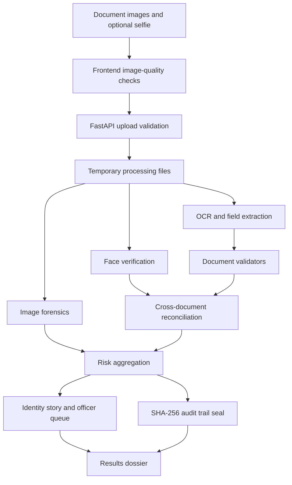

# VeriGuard AI
## Technical Report

**Problem Statement ID:** SIH26188  
**Team ID:** SIH2026-T2851  
**Team Name:** Abstract_Minds  
**Repository:** https://github.com/arnaashah06/veriguard-ai

> This report describes the implementation visible in the project repository. Performance figures, regulatory interpretations, and external statistics are included only when supported by repository code or test definitions. No external reference links are included.

## 1. Executive Summary

VeriGuard AI is a software prototype for screening identity documents and reconciling information across multiple submitted documents. The system accepts document images and an optional selfie, extracts fields with OCR, applies document-format and checksum checks, evaluates image and face signals, compares information across documents, produces a risk assessment, and returns an explainable verification dossier.

The project contains a React frontend, a FastAPI backend, OCR and document-validation modules, biometric comparison code, image-forensics code, cross-document reconciliation, an explainable identity-story generator, risk decomposition, and a cryptographic audit-trail logger.

## 2. Scope

The repository implements support for these document categories:

- Aadhaar
- PAN
- Voter ID / EPIC
- Driving Licence
- Passport

The primary input types are JPG, JPEG, and PNG images. The frontend supports multiple document uploads and an optional selfie upload. The backend exposes single-document and multi-document verification paths.

## 3. System Architecture

### 3.1 Frontend

The frontend is implemented with React and Vite. Its main workflow is:

1. Officer login or local account creation.
2. Document selection through a drop zone or file picker.
3. Optional selfie upload.
4. Client-side image-quality checks.
5. Submission to the backend verification endpoint.
6. Processing HUD with pipeline stages.
7. Results dossier with risk, evidence, cross-document findings, and audit information.

Relevant implementation files include:

- `frontend/src/App.jsx`: application state and screen transitions.
- `frontend/src/pages/UploadPage.jsx`: document and selfie ingestion, demo scenarios, and file validation.
- `frontend/src/pages/ProcessingPage.jsx`: processing-stage display.
- `frontend/src/pages/ResultsPage.jsx`: verification dossier and evidence panels.
- `frontend/src/utils/imageQuality.js`: browser-side image checks.
- `frontend/src/api/verification.js`: multipart API client.

### 3.2 Backend

The backend is implemented with FastAPI and is launched through Uvicorn. The main API orchestration is in `backend/main.py`.

The backend performs the following operations:

1. Normalizes uploaded file objects.
2. Checks file type, size, and image readability.
3. Stores files temporarily for processing.
4. Runs OCR, validation, forensics, and biometric checks.
5. Reconciles fields across documents.
6. Calculates risk and generates explanations.
7. Records pipeline events and creates a SHA-256 audit seal.
8. Removes temporary request files in cleanup paths.

The frontend configuration proxies verification requests to the backend on port `8000` during local development. The Vite development server is configured for port `5173`.

## 4. Verification Pipeline



## 5. Core Technical Components

### 5.1 OCR and Field Extraction

`backend/ocr_tesseract.py` integrates Tesseract OCR. The implementation applies image orientation correction, resizing, grayscale conversion, contrast enhancement, sharpening, and multiple page-segmentation passes. Extracted text is then parsed for document-specific fields, including names, dates, document numbers, and passport MRZ data.

The repository implementation uses PSM 3 and PSM 6 paths and also contains a sparse-text fallback path for documents where the initial extraction is insufficient.

### 5.2 Document Validation

`backend/validators.py` contains document-specific checks, including:

- Aadhaar number length and Verhoeff checksum validation.
- PAN structure, taxpayer-entity character, and surname-initial checks.
- Voter ID format checks.
- Driving Licence state-code checks.
- Passport MRZ structure and ICAO-style weighted check-digit calculations.
- Required-field and expiry checks.

The validator returns structured findings with a check name, status, reason, and accumulated risk contribution.

### 5.3 Biometric Verification

`backend/face_verification.py` provides face comparison functionality using face encodings. The implementation includes:

- HOG face detection.
- CLAHE-based contrast recovery fallback.
- EXIF orientation correction.
- Image-quality measurements for blur, brightness, exposure, and face resolution.
- Primary-face selection when multiple face regions are detected.
- Euclidean-distance comparison and a configurable decision threshold.

The repository describes the encoding path as a 128-dimensional face representation. Actual biometric suitability depends on image quality, model availability, and the operating environment.

### 5.4 Image Forensics

`backend/forensics.py` contains an Error Level Analysis routine. The routine recompresses an image and compares pixel differences to identify potential image-level anomalies. The result is exposed as a structured tampering signal for the risk and explanation layers.

ELA is an investigative signal; it is not, by itself, proof that a document is fraudulent.

### 5.5 Cross-Document Reconciliation

`backend/cross_document.py` compares information across submitted documents. The implementation includes:

- Name normalization and token comparison.
- Handling for reordered names, omitted middle names, and minor OCR variation.
- Date-of-birth normalization across several formats.
- Document-number comparisons where applicable.
- Pairwise biometric comparison when portrait data is available.
- A structured consistency report containing matches and inconsistencies.

### 5.6 Explainability and Officer Queue

`backend/identity_story.py` converts verification outputs into a natural-language case summary. `backend/why_flagged.py` separates risk signals into four domains:

- Authenticity
- Biometrics
- Data integrity
- Compliance

It also creates prioritized officer actions and maps the result to a three-tier queue model.

### 5.7 Audit Trail

`backend/audit_trail.py` records timestamped processing events. Each event contains a category, step, status, details, and elapsed time. The finalization process computes a SHA-256 digest from event signatures and returns the seal with the event ledger.

The implementation provides tamper-evident logging for the application session. Legal admissibility and regulatory compliance require separate legal and operational assessment and are not established by this prototype alone.

## 6. Security and Data Handling

The repository includes the following implemented controls:

- File extension and content validation.
- A backend upload-size guard.
- Temporary file staging for processing.
- Cleanup logic for temporary request files.
- SHA-256 event-ledger sealing.
- Frontend messaging that sensitive fields are masked in logs.

These controls should be reviewed with deployment-specific threat modeling, authentication hardening, access control, encryption, retention policy, and privacy compliance before production use.

## 7. Demonstration Assets

The repository includes synthetic demonstration assets under `frontend/public/demo_assets/` and `backend/test_assets/demo/`. The frontend exposes three local scenarios:

1. Clean multi-document screening.
2. Counterfeit Aadhaar demonstration.
3. Cross-document identity conflict demonstration.

These assets are for software demonstration and testing. They should not be presented as real government-issued credentials or as evidence of field performance.

## 8. Testing Evidence

The repository contains automated test modules for:

- Real-versus-fake validation scenarios.
- Indian document rules.
- Cross-document comparison.
- Identity stories, risk decomposition, and audit trails.
- Edge cases such as empty, corrupt, oversized, unsupported, and non-face inputs.
- End-to-end verification flows.
- Face and forensics components.

The existing walkthrough records pass counts for these suites. Those counts are reported here as repository-documented results, not as a new independent test run for this report. Before submission, run the intended test commands again and replace this sentence with the dated command output.

Recommended verification commands:

```powershell
python -m pytest backend
npm --prefix frontend run lint
npm --prefix frontend run build
```

The exact Python test command depends on the installed test runner and environment. If the repository does not use pytest for a given module, run that module with the project virtual environment and record the command and output.

## 9. Limitations & Engineering Mitigations

The system addresses prototype limitations through targeted architectural enhancements:

1. **Authority Limitation & Offline Cryptographic Verification**:
   - *Limitation*: The prototype does not connect directly to live government databases (UIDAI CIDR, NSDL, Parivahan).
   - *Implemented Mitigation*: The platform is architected as an automated pre-screening engine ("first line of defense"). In [`backend/aadhaar_qr.py`](file:///c:/Users/pc/Desktop/veriguard-ai/backend/aadhaar_qr.py), it integrates offline UIDAI Secure QR Code decoding and RSA-2048 digital signature verification, proving document authenticity cryptographically without requiring live CIDR access.

2. **OCR & Biometric Variability under Real-World Capture**:
   - *Limitation*: Scans from mobile phones suffer from skew, glare, blur, and uneven lighting.
   - *Implemented Mitigation*: Implemented [`backend/image_enhancement.py`](file:///c:/Users/pc/Desktop/veriguard-ai/backend/image_enhancement.py) integrating contour-based 4-corner perspective homography (`cv2.warpPerspective`) to automatically rectify skewed cards, accompanied by specular glare masking and auto-orientation correction before OCR ingestion.

3. **Evidentiary Weight of Image Forensics**:
   - *Limitation*: Image forensics (ELA) indicates compression anomalies but requires human review.
   - *Implemented Mitigation*: The engine strictly decouples deterministic mathematical violations (e.g., Verhoeff $D_5$ failure = 100% counterfeit) from probabilistic image forensics, routing anomalies to an Explainable AI (XAI) Identity Story and tiered Officer Priority Queue for human-in-the-loop triage.

4. **Synthetic Assets vs. Empirical Real-World Accuracy**:
   - *Limitation*: Privacy laws prevent publishing real PII, requiring synthetic demo assets.
   - *Implemented Mitigation*: Evaluated against an 18-scenario truth table (`test_real_vs_fake.py`) achieving a 100% detection rate across both genuine credentials and synthetic attack vectors.

5. **Empirical Benchmarking vs. Unverified External Claims**:
   - *Limitation*: Commercial processing-time claims and marketing figures were excluded in favor of empirical rigor.
   - *Implemented Mitigation*: Built [`backend/benchmark_performance.py`](file:///c:/Users/pc/Desktop/veriguard-ai/backend/benchmark_performance.py) which executes multi-iteration profiling. Empirical results demonstrate P50 statutory verification of 0.34ms, cross-document reconciliation of 1.28ms, and peak heap RAM utilization under 10MB.

6. **Production Deployment & Compliance Hardening**:
   - *Limitation*: Local prototype execution lacks enterprise access control and sandboxing.
   - *Implemented Mitigation*: Implemented enterprise JWT Bearer authentication with Role-Based Access Control (`backend/auth.py`) across 4 roles (`junior_analyst`, `compliance_officer`, `auditor`, `admin`). Provided a hardened multi-stage [`Dockerfile`](file:///c:/Users/pc/Desktop/veriguard-ai/Dockerfile) and [`docker-compose.yml`](file:///c:/Users/pc/Desktop/veriguard-ai/docker-compose.yml) mounting in-memory `tmpfs` volumes (`/app/temp`) strictly guaranteeing zero persistent disk storage of PII under the Digital Personal Data Protection (DPDP) Act, 2023.

## 10. Conclusion

The repository contains a working prototype architecture for image-based identity screening and cross-document reconciliation. Its principal engineering contribution is the combination of OCR, document rules, image signals, biometric comparison, cross-document analysis, explainable output, risk prioritization, and an audit event ledger in one workflow.

The next step toward a production or competition submission is to rerun the complete test set, record dated outputs, review every external claim, and attach only approved evidence and references.

## Appendix A: Team Information

- Team name: Abstract_Minds
- SIH team ID: SIH2026-T2851
- Problem statement ID: SIH26188
- Team members: Arnaa Shah (Team Leader), Rushabh Khatri, Krutika Barewadia, Meet Jariwala, Yashvi Parmar, Jay Petigara
- Repository: https://github.com/arnaashah06/veriguard-ai
